### 循环

```c
int x = 0;
int ret = 0;

scanf("%d", &x);
while (x > 1) {
    x /= 2;
    ret++;
}
printf("log2 of %d is %d\n", x, ret);
```

```c
int x = 0;
int ret = 0;

scanf("%d", &x);
int t = x;
while (x > 1) {
    x /= 2;
    ret++;
}
printf("log2 of %d is %d\n", t, ret);
```


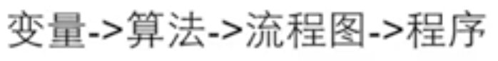

```c
// 整数逆序
int x;
int digit;
int ret;

while (x > 0) {
    digit = x % 10;
    ret = ret * 10 + digit;
    printf("x = %d, digit = %d, ret = %d\n", x, digit, ret);
    x /= 10;
}
printf("%d", ret);
```


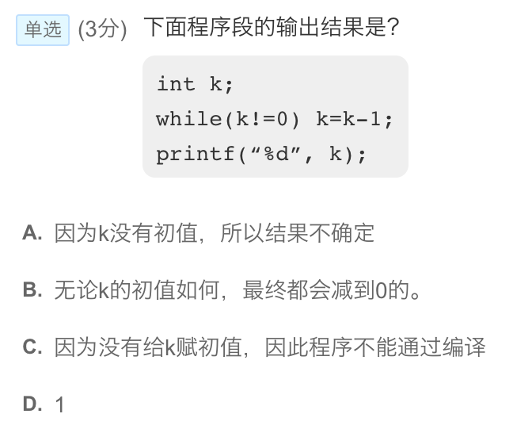


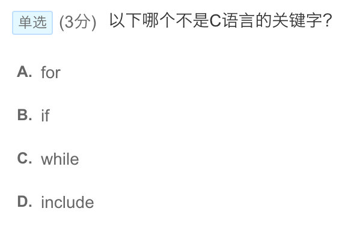

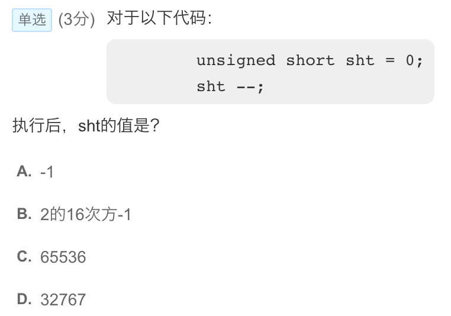

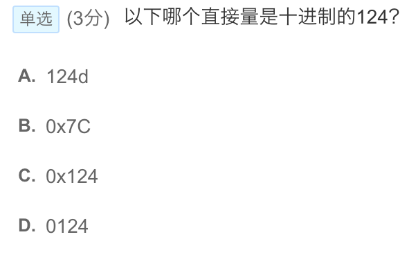

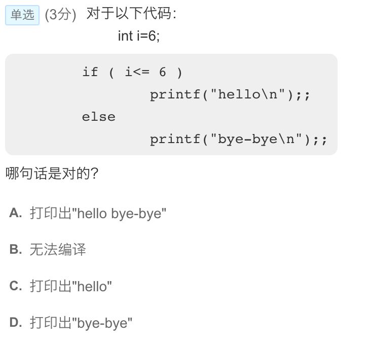

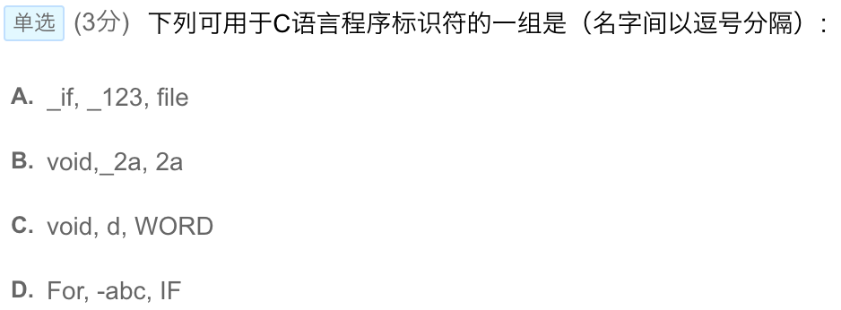

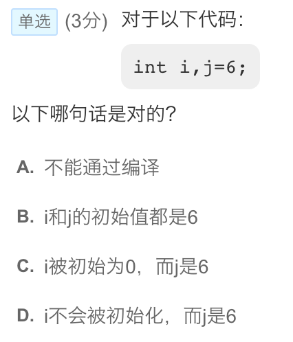

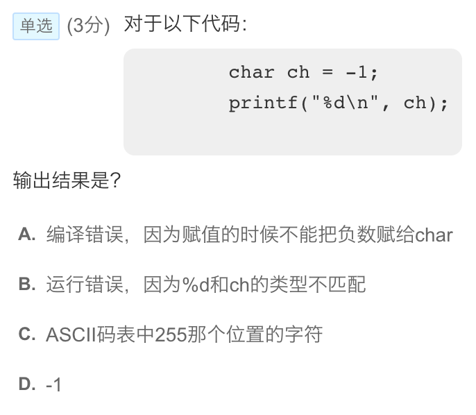

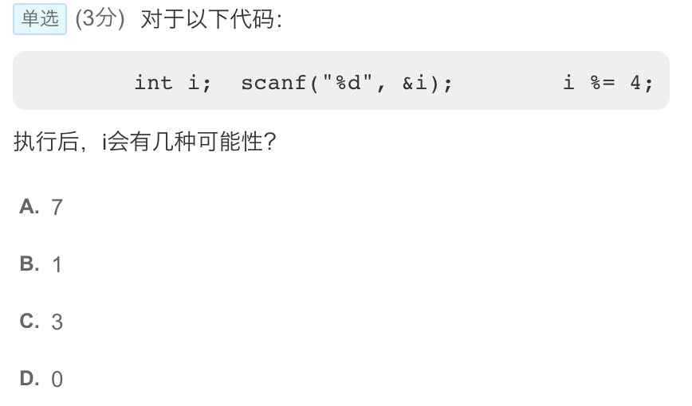

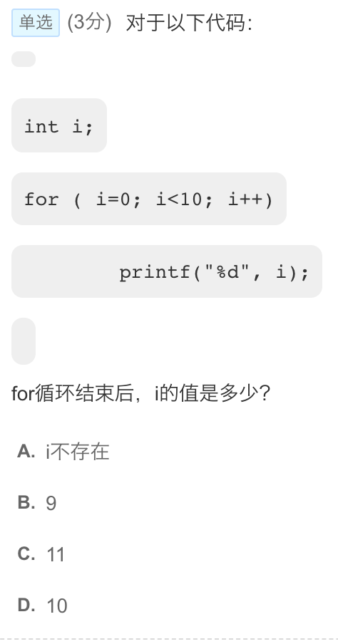

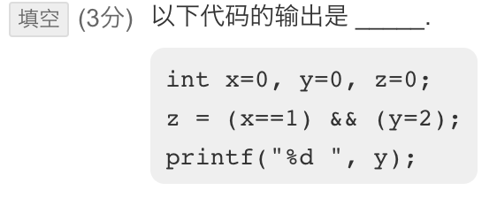


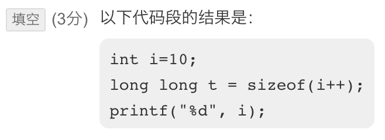

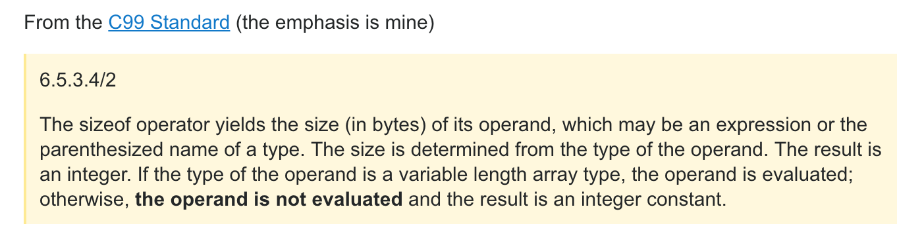

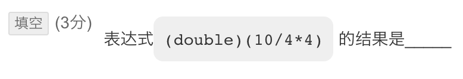

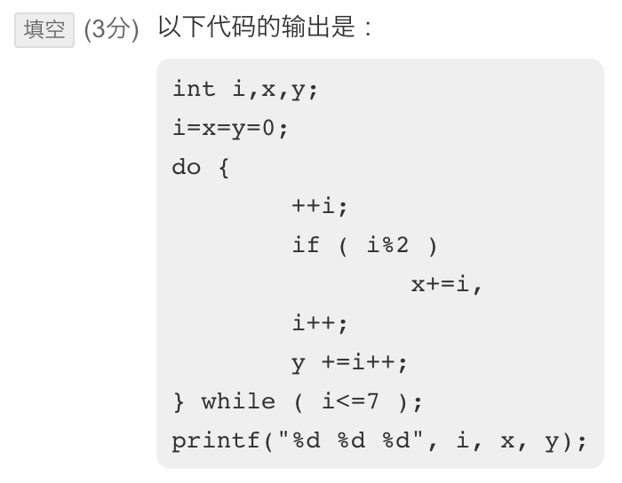


