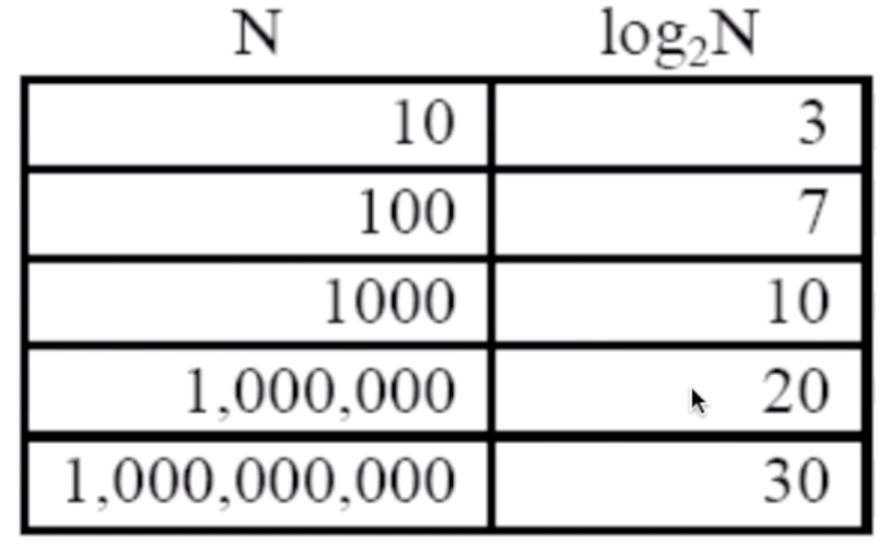

- 汉诺塔

  来解释解释上上次没讲清楚的递归的事情

  - 小学奥数题——Hanoi Tower

    三根杆子，n个盘子从小到大自上往下堆叠，要从一根杆子搬到另外一根，在搬运的过程中不能破坏盘子的上下顺序（小的盘子必须在上面）

    

```c
#include <stdio.h>

void move(int n, char from, char dst, char tmp) {
    if (n == 1) {
        printf("%c->%c\n", from, dst);
    }
    else {
        move(n-1, from, tmp, dst);
        printf("%c->%c\n", from, dst);
        move(n-1, tmp, dst, from);
    }
}

int main() {
    char A = 'A';
    char B = 'B';
    char C = 'C';
    move(3, A, C, B);
    return 0;
}
```

- 搜索

  - 线性搜索（挨个找）

  - 二分搜索（针对排好序的数组）

    

- 排序

  - 有序才能快速搜索
  - 选择排序
  - 冒泡排序
  - 插入排序

