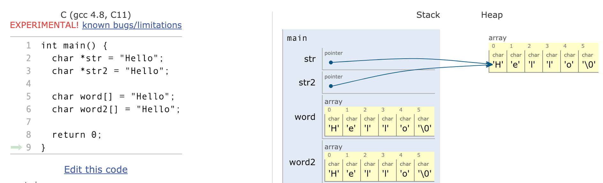

### 字符串

char的数组

| 函数           | 描述                                                         |
| -------------- | ------------------------------------------------------------ |
| strcpy(s1, s2) | 复制字符串s2到字符串s1，注意s1的空间应比s2大                 |
| strcat(s1, s2) | 链接s2到s1的末尾                                             |
| strlen(s1)     | 返回s1的长度（即第一个'\0'所在位置 - 开始位置）              |
| strcmp(s1, s2) | 比较s1和s2是否一致，一致返回0，不一致则返回不一致位s1-s2的值 |
| strchr(s1, ch) | 返回一个指针，指向s1中第一个ch字符出现的位置                 |
| strstr(s1, s2) | 返回一个指针，指向s1中s2第一次出现的位置，没有返回NULL       |


```c
char a[] = {'H', 'e', 'l', 'l', 'o'};		// 这个叫字符数组
char b[] = {'H', 'e', 'l', 'l', 'o', '\0'}; // 这个叫字符串

// "Hello" 被称为字符串常量（字符串字面量）
// 其中如果有两个相邻的字符串，C会帮你将两个字符串连接起来
printf("Hello,"
      	"World!\n");

// 下面三种初始化字符串的方式并不相同
char *str = "Hello";
char word[] = "Hello";
char line[10] = "Hello";

```




那么我们应该怎么选择呢？

- 数组：这个字符串就在这里
  - 是一个本地变量（图中是在main函数里），会被自动回收
- 指针：并不知道字符串在哪里
  - 处理函数参数的时候使用（反正都丢失了长度信息）
  - 动态分配空间（malloc）

数组用来**构造**字符串

指针用来**处理**字符串

char *也不一定就是字符串（必须有结尾的那个0, \0）


常见错误

```c
char *string;
scanf("%s", string);
```

```c 
char buffer[100] = "";	// len(buffer) == 100	-> 有100个char的长度
char buffer = '';		// len(buffer) == 1		-> 只有那个 \0
```

```c
char s1[] = "ABC";
char s2[] = "ABC";

// 其实是在比较s1和s2的地址（一定不等）
if (s1 == s2) {
    // ...
}

// strcmp在两个字符串相等的时候返回0
// 其实strcmp就是对两个字符串中每对字符相减直到某个串结束

int i = 0;
while (s1[i] == '\0' || s2[i] == '\0') {
    char tmp = s1[i] - s2[i];
    if (!tmp) {
        i++;
    } else {
        break;
    }
}

if (!strcmp(s1, s2)) {
    // ...
}
```


------

### 结构体

我们之前有了解了数组这一数据结构，它将一组同样数据类型的数据有序的保存起来，如

```c
int arr[10];
```

这一行就定义了一个保存10个int数据类型的数组，且能够通过数组特定下标对其进行随机访问

但当我们的数据并不仅仅只有一种类型的时候，数组就不能够很好的进行表示了（当表示二维坐标的时候）